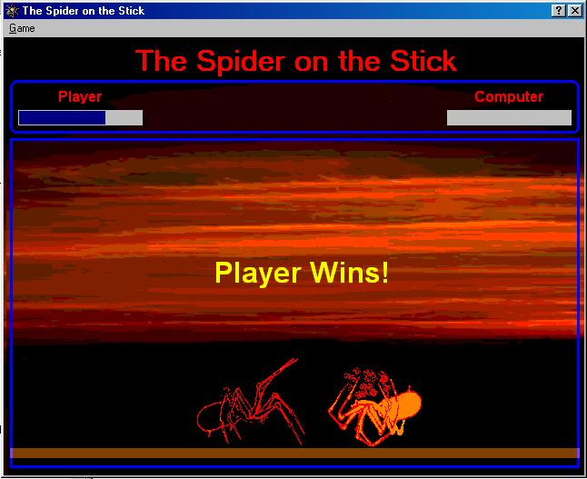



## THE SPIDER ON THE STICK GAME\(A spider fighting game complete with AI\.\.\. a must see\.\)

### Description

This demonstrates a spider fighting game which can be played by one or two players. Soon i will add some features in which you can play this in a network environment. And don't forget to vote for it.
 
### More Info
 

             |
---                |---
**Submitted On**   |2001-01-29 23:53:12
**By**             |[Walter Narvasa](https://github.com/Planet-Source-Code/PSCIndex/blob/master/ByAuthor/walter-narvasa.md)
**Level**          |Advanced
**User Rating**    |4.3 (34 globes from 8 users)
**Compatibility**  |VB 6\.0
**Category**       |[Games](https://github.com/Planet-Source-Code/PSCIndex/blob/master/ByCategory/games__1-38.md)
**World**          |[Visual Basic](https://github.com/Planet-Source-Code/PSCIndex/blob/master/ByWorld/visual-basic.md)
**Archive File**   |[CODE\_UPLOAD142731292001\.zip](https://github.com/Planet-Source-Code/walter-narvasa-the-spider-on-the-stick-game-a-spider-fighting-game-complete-with-ai-a-must__1-14797/archive/master.zip)

